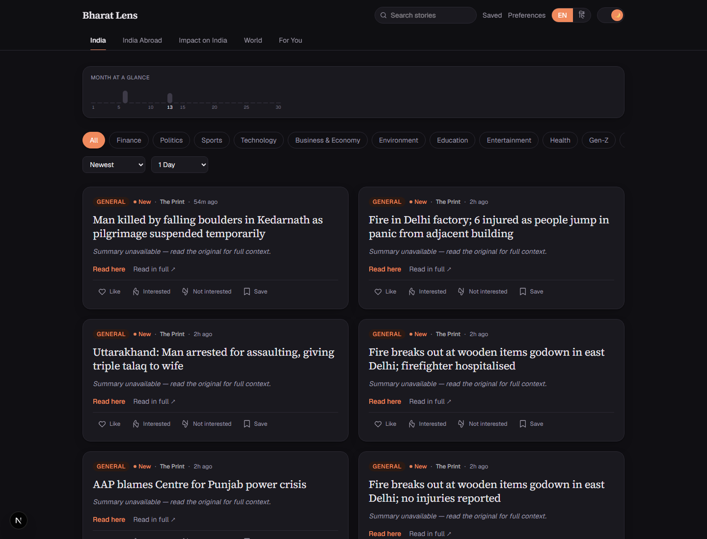
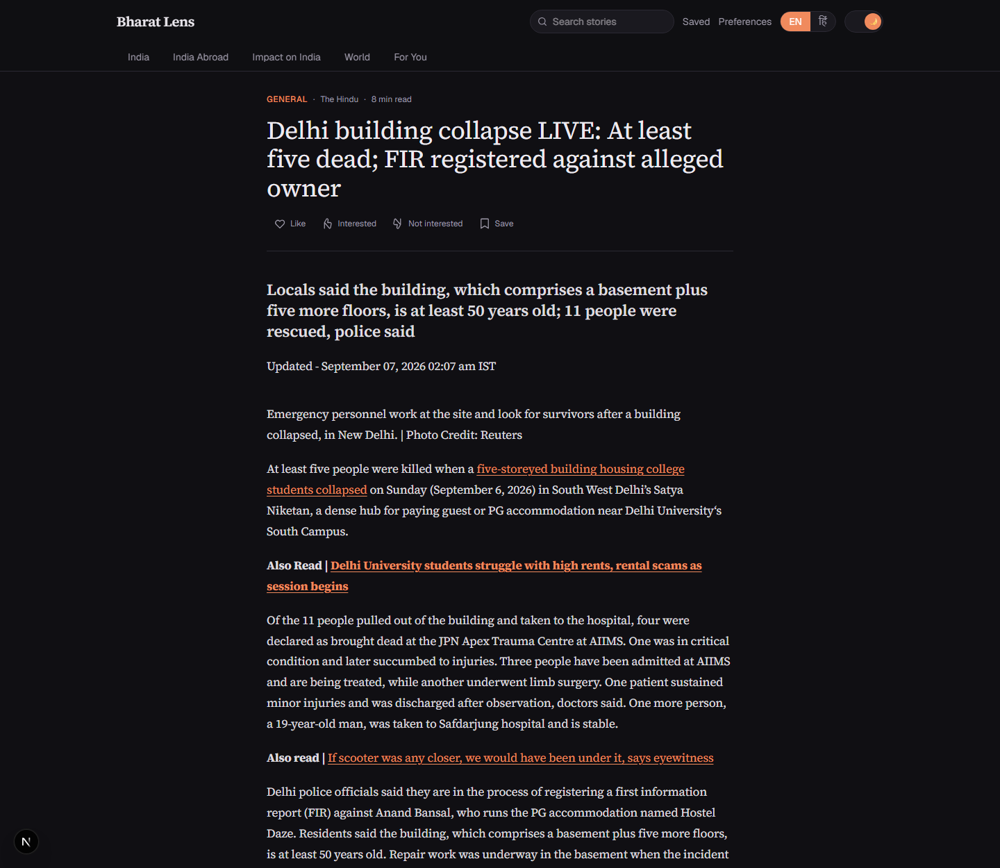
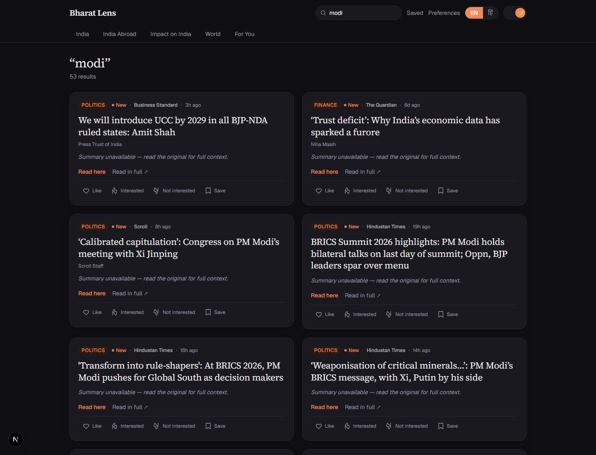
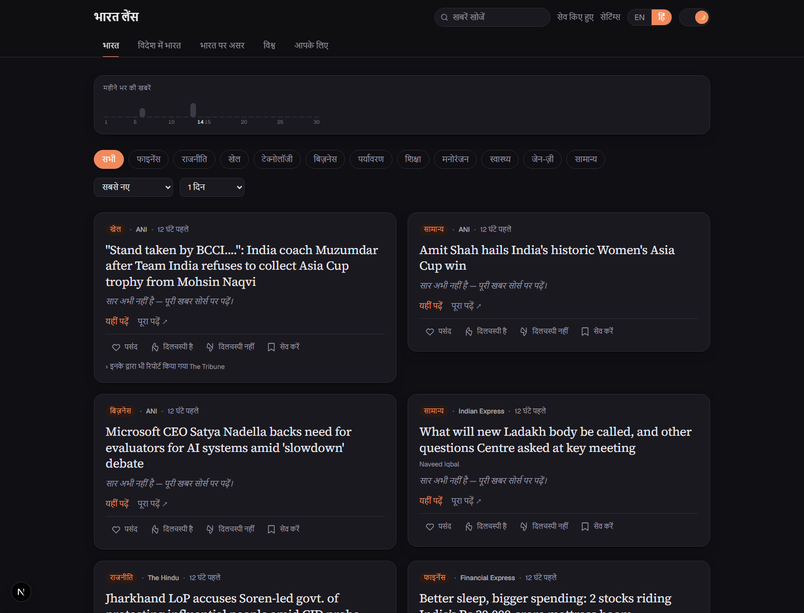

# Bharat Lens

An India-first news reader. One place to see what is happening in India, what Indians
abroad are dealing with, what is hitting India from outside, and the wider world —
pulled from wire services and newspapers, deduplicated across outlets, in English or
Hindi.

No sign-up. No account. Nothing personal stored.



<details>
<summary>More screenshots</summary>

**The in-app reader** — publisher markup sanitized, navigation stripped, then a
hand-off to the source.



**Search** across every source and date.



**In Hindi** — every string, including the filters and the action row.



</details>

## Why I built it

I read a lot of news and I was doing it badly — six tabs open, the same PTI story
under four different headlines, and no way to tell whether something mattered to India
or just happened to be in an Indian newspaper.

So I wanted three specific things:

1. **One story, one card.** If six papers carry the same wire copy, show it once and
   tell me who else ran it.
2. **A distinction between "in India" and "about India."** An Indian paper's world
   desk is world news. A Reuters story about tariffs on Indian steel is India news.
   Those are different questions and no reader I tried made the distinction.
3. **Something I could actually read.** Two sentences of plain summary, no autoplay
   video, no ten-item listicle about a cricketer's haircut.

## What it does

- **Five scopes × eleven categories**, freely combinable — Finance-in-World and
  Sports-in-Impact-on-India are both real views
- **35 sources.** Wires: PTI, ANI, Reuters, AP, AFP. Indian press: The Hindu, Indian
  Express, Times of India, Hindustan Times, Livemint, Business Standard, Economic
  Times, Financial Express, BusinessLine, Moneycontrol, The Telegraph, Deccan Herald,
  Deccan Chronicle, The Tribune, New Indian Express, Scroll, The Print, The Wire,
  Firstpost, Outlook. Global: BBC, The Guardian, Bloomberg, Al Jazeera, Nikkei Asia,
  SCMP, The Straits Times, Dawn, Arab News, The National.
  **Print and wire only — no television news**
- **One card per story**, listing every outlet that ran it
- **Two-sentence summaries** grounded strictly in the fetched article text
- **English and Hindi**, with translations cached so each one is paid for once.
  `?lang=hi` on any URL makes the choice shareable
- **A clean in-app reader**, or straight to the publisher — your choice per story
- **Like, interested, not interested, save** — with collections, notes and a
  come-back-to-it date
- **A For You feed** built from the categories you pick and the stories you react to
- **A month timeline** marking days when something actually happened
- **Paged feeds**, so the whole corpus is reachable rather than the first 40 stories

Personal features are keyed to an anonymous cookie, not an account. The tradeoff is
that your saves live in one browser; in exchange there is no sign-up form and no
password to forget.

## Running it

```bash
git clone https://github.com/Anubhavkumarkanth/Bharat-lens.git
cd Bharat-lens
npm install
cp .env.example .env.local     # add a DATABASE_URL
npm run db:push                # create the tables
psql "$DATABASE_URL" -f drizzle/manual/0001_search_index.sql   # search index
npm run ingest                 # first run records a quiet baseline
npm run dev
```

Only `DATABASE_URL` is required — any Postgres works; I use Supabase's free tier.

Everything else is optional. With no AI key you get headline-and-source cards instead
of summaries, and nothing else changes. If you want summaries, Google AI Studio has a
free tier — put the key in `GEMINI_API_KEY`.

### Useful scripts

```bash
npm run ingest            # run the pipeline
npm run stats             # corpus stats by scope, category and source
npm run reclassify        # re-classify stored rows after a taxonomy change
npm run recluster         # rebuild story clusters after a clustering change
npm run decode-entities   # clean HTML entities and stray control chars in titles
npm run resummarize       # re-summarize stored rows after a prompt change
npm run test:classify     # classifier assertions
npm run debug-source reuters ap
```

`reclassify` matters more than it sounds: articles are classified once when they are
ingested, so changing the taxonomy does nothing to rows already in the database until
you re-run it.

## Stack

| Layer | Choice |
| --- | --- |
| Framework | Next.js 16 (App Router), TypeScript, Tailwind v4 |
| Database | Postgres via Drizzle ORM |
| Ingestion | Scheduled route at `/api/cron/ingest`, writes to Postgres |
| AI | Optional, provider-swappable behind one interface (Gemini or Anthropic) |
| Hosting | Vercel |

## What I learned building this

The part I expected to be easy was reading RSS feeds. It turned out **five of my
seventeen sources publish no usable RSS at all** — including Reuters and AP — so feed
discovery became a four-step cascade ending in recursive sitemap parsing. That one
finding reshaped the whole ingestion design.

The part I expected to be hard was deduplication, and it was, but not for the reason I
thought. The same URL appearing twice is trivial. The same *story* from six different
papers is a similarity problem, and it needs a different mechanism entirely.

I also learned to be suspicious of substring matching. Checking whether a headline
contains `"ai"` matches "said", "again" and "chair" — it inflated my Technology
category by about 14x before I noticed. Word boundaries matter.

And I made one call I keep coming back to: **the app has to work with no AI key.**
Every ranking, filter and classification is deterministic, and the model only adds
summaries and translation on top. It means the app is cheap, it survives an API
outage, and anyone can clone it and run it without spending money. It also forced me
to write real logic instead of asking a model to do the thinking.

There is more detail in [`docs/ARCHITECTURE.md`](docs/ARCHITECTURE.md), including the
bugs that cost me the most time.

## Known limitations

I would rather list these than have you find them.

- **About 60% of stories land in the General bucket.** A headline plus a URL path
  only carries so much signal, and publishers using generic paths like `/article/`
  give you nothing to read. It has its own category rather than being quietly folded
  into a real one — burying them under Business & Economy made that filter useless.
  AI-assisted classification of the leftovers is the intended fix.
- **A publisher's own re-filings of a story show separately.** Clustering groups the
  same story *across* outlets, and deliberately refuses to merge two articles from
  the same source — without that rule, title similarity collapsed fifteen unrelated
  AP regional listings into one card. The cost is that when an outlet posts "six
  injured" and then "no injuries reported" an hour later, you see both. Telling those
  apart from genuinely different stories needs more than title overlap.
- **"Most Popular" is a proxy.** It sorts by the deterministic score, because there is
  no view tracking yet.
- **No full article text is shown for any source.** The reader can display it, but the
  per-source permission flag ships off for all 17 — none of them grants republication
  rights. You get a lead-in and a link out.
- **Saves are per-browser.** That is the cost of having no accounts.
- **The cron runs once a day on Vercel's free plan**, which caps cron frequency at
  daily. More often needs an external scheduler hitting the endpoint.

## License

MIT — see [LICENSE](LICENSE).
