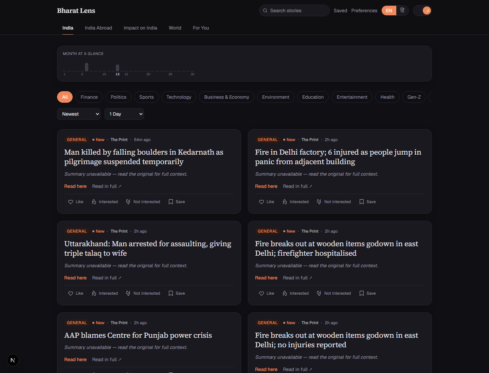
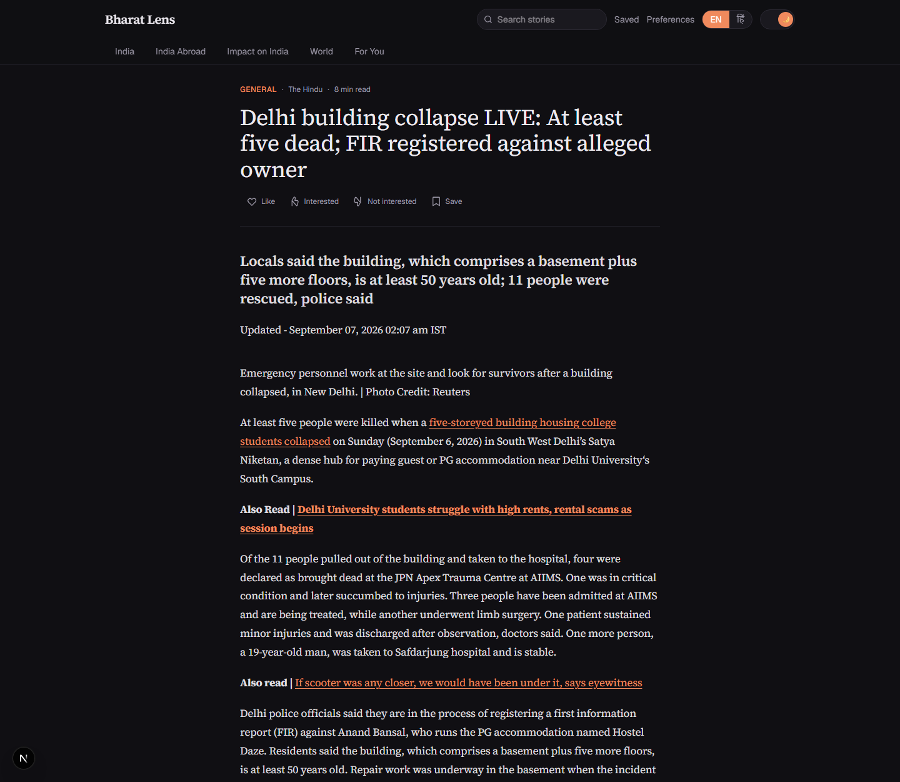
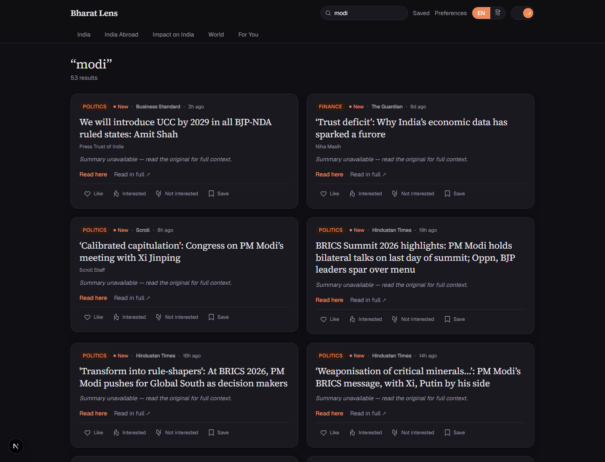
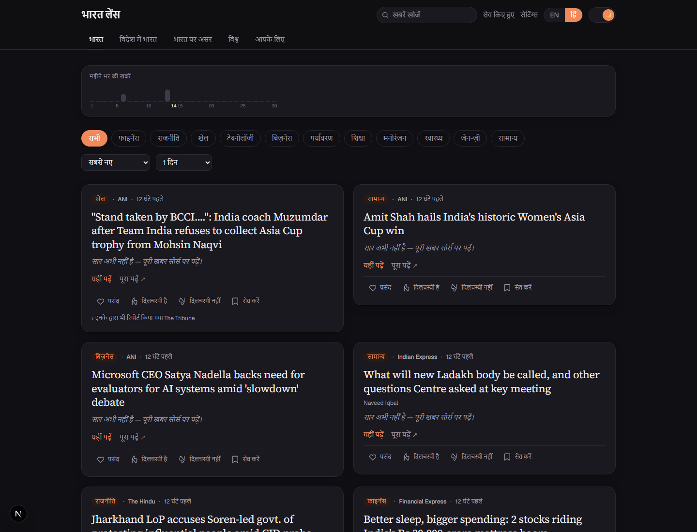

# Bharat Lens

A news reader focused on India. It pulls from wire services and newspapers, groups the
same story from different outlets into one card, and splits things into India, Indians
abroad, things abroad that affect India, and world news. English or Hindi.

No sign-up and no accounts.

**Ingestion · Clustering · Search · REST API · PostgreSQL · Analytics · Data quality**

```
sources → TypeScript ingestion → PostgreSQL (dedup, clustering, search, analytics)
        → REST API → React dashboard      (Python for offline corpus analysis)
```



<details>
<summary>More screenshots</summary>

The in-app reader (publisher HTML cleaned up, with a link back to the source):



Search:



Hindi:



</details>

## Why

I read a lot of news, badly. Six tabs open, the same PTI story under four different
headlines, and no easy way to tell if something actually mattered to India or just
happened to be printed in an Indian paper.

What I wanted:

1. One card per story. If six papers run the same wire copy, show it once and list who
   else ran it.
2. "In India" and "about India" kept apart. An Indian paper's world desk is world news,
   but a Reuters piece on tariffs on Indian steel is India news. None of the readers I
   tried made that distinction.
3. Something short to read. Two plain sentences per story, no autoplay video.

## Features

- 5 scopes and 11 categories that can be combined (e.g. Finance in World, Sports in
  Impact on India)
- 35 sources. Wires: PTI, ANI, Reuters, AP, AFP. Indian papers: The Hindu, Indian
  Express, Times of India, Hindustan Times, Livemint, Business Standard, Economic Times,
  Financial Express, BusinessLine, Moneycontrol, The Telegraph, Deccan Herald, Deccan
  Chronicle, The Tribune, New Indian Express, Scroll, The Print, The Wire, Firstpost,
  Outlook. International: BBC, The Guardian, Bloomberg, Al Jazeera, Nikkei Asia, SCMP,
  The Straits Times, Dawn, Arab News, The National. Print and wire only, no TV.
- One card per story with the list of outlets that ran it
- Two-sentence summaries, written only from the article's own text
- English and Hindi. Translations are cached so each one is only paid for once, and
  `?lang=hi` works on any URL
- An in-app reader, or a link straight to the publisher
- Like / interested / not interested / save, plus collections, notes and a "come back
  to this" date
- A For You feed based on the categories you pick and what you react to
- A month timeline that marks days with big news
- An insights page: who gets stories out first, overlap with the wires, what each
  outlet covers, and which sources have gone quiet
- Paged feeds, so you can get past the first 40 stories
- A read-only [REST API](docs/API.md) over the corpus (articles, search, stats,
  sources, health) with validated params, consistent JSON and proper status codes

Personal stuff is tied to an anonymous cookie instead of an account. Your saves only
live in one browser, but there's no sign-up and nothing personal is stored.

## Running it

```bash
git clone https://github.com/Anubhavkumarkanth/Bharat-lens.git
cd Bharat-lens
npm install
cp .env.example .env.local     # add a DATABASE_URL
npm run db:push                # create the tables
npm run db:setup               # search index + analytics views
npm run ingest                 # the first run is a quiet baseline
npm run dev
```

Only `DATABASE_URL` is required. Any Postgres works, I use Supabase's free tier.

AI is optional. Without a key you get headline + source cards instead of summaries and
everything else works the same. For summaries, Google AI Studio has a free tier; put
the key in `GEMINI_API_KEY`.

### Deploy it for free

Everything here fits in free tiers: Neon for Postgres, Vercel Hobby for the app,
GitHub Actions for the weekly analysis.

1. **Database.** Create a free project on [Neon](https://neon.tech) (it wakes on
   connection instead of pausing, so the project stays put). Copy the pooled
   connection string from the dashboard. Put it in `.env.local` as `DATABASE_URL`
   and run `npm run db:push`, `npm run db:setup` and `npm run ingest` once from your
   machine. Any Postgres works — it also runs on a local cluster for development.
2. **App.** On [Vercel](https://vercel.com), import the GitHub repo (Hobby plan, the
   Next.js defaults are fine). Under Environment Variables add `DATABASE_URL`, a random
   `CRON_SECRET`, and optionally `GEMINI_API_KEY`. Deploy.
3. **Daily ingest.** `vercel.json` already runs `/api/cron/ingest` once a day. For more
   often, make a free job on [cron-job.org](https://cron-job.org) that calls
   `https://<your-app>.vercel.app/api/cron/ingest` every few hours with the header
   `Authorization: Bearer <CRON_SECRET>`.
4. **Weekly analysis.** In the GitHub repo, add `DATABASE_URL` under Settings > Secrets
   and variables > Actions, then run the "Analysis report" workflow once from the
   Actions tab.

### Scripts

```bash
npm run ingest            # run the pipeline
npm run db:setup          # apply the SQL in drizzle/manual/
npm run stats             # counts by scope, category and source
npm run reclassify        # re-classify stored rows after changing the taxonomy
npm run recluster         # rebuild story clusters
npm run decode-entities   # fix HTML entities in titles
npm run resummarize       # redo summaries after changing the prompt
npm run test:classify     # classifier tests
npm run debug-source reuters ap
```

Articles are classified once, when they're ingested. If you change the taxonomy you
need to run `reclassify` or nothing already in the database changes.

## Data analysis

After a few weeks the database had enough articles that I started treating it as a
dataset. The [`analysis/`](analysis/) folder looks at:

- which outlet gets a shared story out first, and how far behind the rest are
- whether Indian papers trail the wires (binomial test on stories both ran)
- which outlets cover the same stories (Jaccard, clustered)
- whether outlets have a beat (chi-square, Cramér's V, location quotients)
- when news gets published, in IST

The cleaning rules are SQL views in
[`0002_analytics_views.sql`](drizzle/manual/0002_analytics_views.sql), and both the
`/insights` page and the notebook read from them. The main issue is publish times:
publishers set their own, and a fair number are missing, just a date, or in the
future, so those are left out of anything about speed.

```bash
pip install -r analysis/requirements.txt
pytest analysis
python analysis/report.py --days 30   # writes analysis/output/
```

A GitHub Action reruns it against production every Monday and commits the results to
[`analysis/output/FINDINGS.md`](analysis/output/FINDINGS.md). More in
[`analysis/README.md`](analysis/README.md).

## Stack

| | |
| --- | --- |
| App | Next.js 16 (App Router), TypeScript, Tailwind v4 |
| Database | Postgres + Drizzle |
| Ingestion | TypeScript pipeline, run by a cron route at `/api/cron/ingest` |
| API | REST route handlers under `/api/*` — see [docs/API.md](docs/API.md) |
| AI (optional) | Gemini or Anthropic, behind one interface |
| Hosting | Vercel |
| Analysis | SQL views, Python (pandas, SciPy, matplotlib), Jupyter |

## Things I learned

I thought reading RSS feeds would be the easy part. Turns out 5 of my first 17 sources
(Reuters and AP included) don't have usable RSS, so feed discovery ended up as a
four-step fallback that finishes with parsing sitemaps.

Deduplication was hard, but not how I expected. The same URL twice is easy. The same
story from six different papers is a text similarity problem and needs its own logic.

Substring matching bit me. Checking if a headline contains "ai" also matches "said",
"again" and "chair", which made the Technology category about 14x too big until I
switched to word boundaries.

I also decided early that the app has to work with no AI key. Ranking, filtering and
classification are all plain code, and the model only adds summaries and translation.
That keeps it cheap, it keeps working if an API is down, and anyone can run it for
free.

More detail (and the bugs that took the longest) in
[`docs/ARCHITECTURE.md`](docs/ARCHITECTURE.md).

## Known issues

- About 60% of stories end up in General. A headline and a URL often aren't enough to
  go on, especially with URLs like `/article/12345`. I'd rather have an honest General
  bucket than dump them into Business & Economy, which is what used to happen. Using
  AI to classify the leftovers is the plan.
- If an outlet posts an update to its own story, both show up. Clustering only groups
  stories across different outlets, on purpose: when same-outlet merging was allowed,
  fifteen unrelated AP regional listings got merged into one card.
- "Most Popular" isn't based on views yet, there's no view tracking. It uses the
  ranking score.
- Full article text isn't shown for any source. The reader can do it, but it's turned
  off per source because none of them allow republishing. You get the opening and a
  link.
- Saves are per browser, since there are no accounts.
- The cron runs once a day because that's the limit on Vercel's free plan. For more
  often you need an external scheduler to call the endpoint.

## License

MIT, see [LICENSE](LICENSE).
